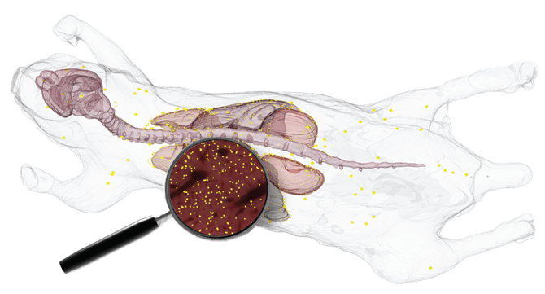
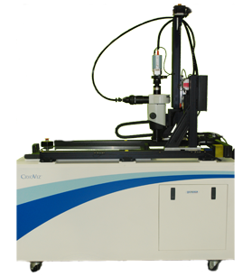

# Ben D. Moore - Technical Product & Software Engineering Manager

## CryoViz - Whole-Mouse 3D Disease & Toxicology Imaging Platform

### Overview

© 2026 BioInVision Inc.

During my undergraduate research at Case Western Reserve University, I worked on BioInVision’s CryoViz imaging system, a 3D microscopy platform that reconstructs an entire mouse from sequential tissue sections. The system enables multi-scale analysis from organ-level structure down to labeled cells, supporting studies in drug toxicity and biological signal distribution across whole organisms.

### Problem

Drug toxicity and biological studies were traditionally performed using **manual necropsy with scalpels**, where researchers analyzed isolated tissue slices. This process was slow, labor-intensive, and inherently fragmented, making it difficult to understand how effects—such as drug distribution or cell movement—propagated across the entire organism.

### My Role

I worked on the imaging and analysis pipeline that transformed raw sectioned data into usable biological representations. This included building image processing pipelines, contributing to visualization systems, and supporting downstream analysis used in research workflows. Typical datasets were large volumetric reconstructions, often reaching **100 GB per specimen**.

### System Design

© 2026 BioInVision Inc.

CryoViz alternates automated sectioning with bright-field and fluorescence imaging to capture sequential images of a specimen, which are then reconstructed into a continuous 3D volume. The system enables:

- Whole-mouse reconstruction with spatial continuity
- Fluorescence-based detection (e.g., eGFP, labeled cells, biomarkers)
- Multi-scale analysis from tissue structure to labeled cells

This allows researchers to track where cells, compounds, or signals are distributed across the organism, rather than inferring from isolated samples.

### Key Tradeoffs

The primary tradeoff was moving from **manual, slice-based necropsy to automated whole-organism reconstruction**, prioritizing holistic interpretation over isolated views. A secondary tradeoff was **resolution versus throughput**, balancing micron-level detail with scalable full-specimen reconstruction.

### Outcome

The system replaced fragmented scalpel-based sampling with automated 3D reconstruction of the entire mouse, enabling researchers to directly observe system-wide patterns such as drug distribution, toxicity effects, and labeled cell localization.

---

## Genetesis - Clinical AI Decision Systems

### Overview

© 2024 Genetesis LLC

At Genetesis, I worked on a clinical AI system for cardiac imaging that supported clinicians in interpreting physiological signals during diagnostic workflows. The system combined a risk score, classification output, and sensor health validation to provide both diagnostic guidance and data-quality assessment in regulated clinical environments.

### Problem

Cardiac imaging interpretation was highly operator-dependent, leading to variability across users and sites. While ML models were available to assist interpretation, outputs were not consistently trusted or integrated into clinical workflows. A key gap was that clinicians also needed to validate whether scan data itself was reliable before interpreting model results, making model output alone insufficient for decision-making.

### My Role

I worked primarily on the product, workflow, and system design layer of the platform. This included defining how clinicians interacted with model outputs, designing the end-to-end interpretation workflow, and specifying scan quality and sensor health metrics. I also collaborated with engineering and hardware teams to align system constraints and contributed to training and UAT workflows used for validation.

### System Design

%201.webp)

© 2024 Genetesis LLC

The system produced three tightly coupled outputs: a risk score, a classification, and a sensor health signal. I designed the experience so these were not treated as independent predictions, but as a single decision workflow.

Clinicians moved through a structured flow:
raw signal → scan quality / sensor validation → model outputs → interpretive review

The system also supported adjustable thresholds to account for different patient populations and clinical contexts, ensuring outputs could be contextualized rather than treated as fixed predictions.

### Key Tradeoffs

The primary tradeoff was **interpretability versus model performance**, where we prioritized transparency and traceability over marginal accuracy improvements. A second tradeoff was **automation versus clinical oversight**, which led to explicitly surfacing sensor health and scan quality signals rather than abstracting them away into a single score.

### Outcome

The system standardized scan interpretation workflows across multiple clinical sites and improved consistency in how outputs were evaluated. It also reduced onboarding complexity by introducing a structured interpretation process that new users could reliably follow.

---

## Quick Bytes - SNAP Meal Planning (Concept Project)

### Overview

Quick Bytes was a concept design project completed as part of my Master’s coursework in Computer Science at Georgia Tech. The project explored how to design a decision support system for SNAP users making real-time food and budgeting decisions under tight constraints.

### Problem

SNAP users operate under strict budget and dietary constraints, requiring continuous tradeoffs between cost, nutrition, and availability during real shopping contexts. Existing tools primarily focus on tracking calories or spending, but do not actively support structured decision-making at the point of purchase.

### My Role

I contributed to the end-to-end system design and decision framework for the concept. This included defining how user constraints were represented, how feasible options were generated, and how recommendations were structured in the interface. The focus was on translating constraint-heavy inputs into actionable, low-friction decisions.

### System Design

The system takes structured inputs such as budget, dietary preferences, and location, and applies constraint-based filtering to identify viable food options. These options are then ranked and surfaced as recommendations rather than raw data, emphasizing decision guidance over information exposure.

The core flow is:
user constraints → feasibility filtering → ranking → structured recommendations

### Key Tradeoffs

The primary tradeoff was **guidance versus information density**, where we prioritized structured, actionable recommendations over exposing large sets of raw options. A second tradeoff was **constraint enforcement versus flexibility**, ensuring dietary and budget constraints were strictly respected while maintaining usability in real-time contexts.

### Outcome

The project produced a complete concept for a constrained decision support system and demonstrated a structured approach to translating real-world constraints into actionable recommendations. It also highlighted gaps in existing consumer tools, which tend to optimize for tracking rather than decision support.
